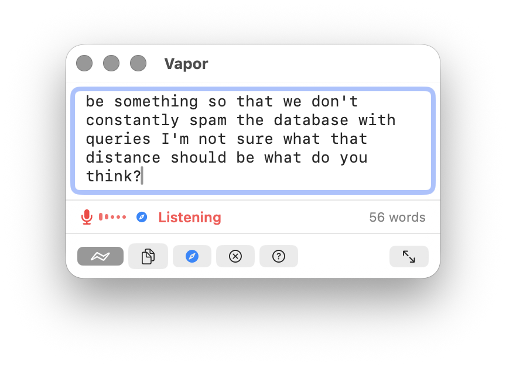
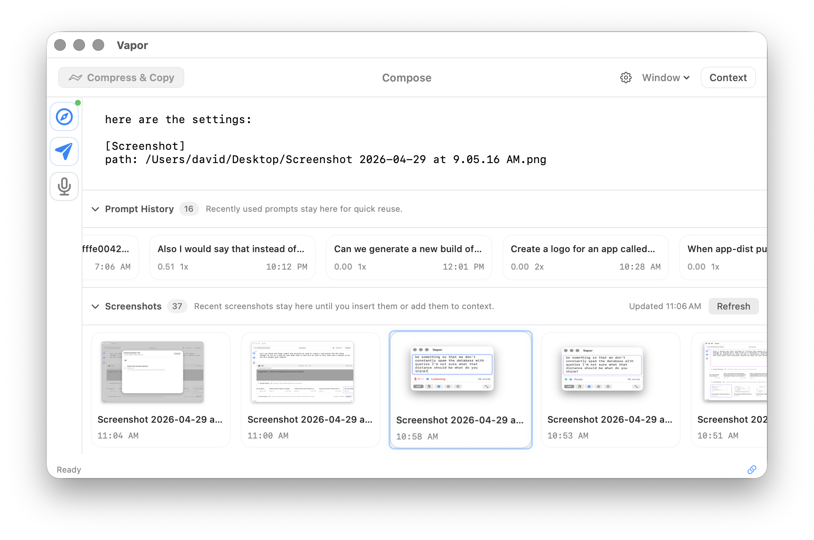
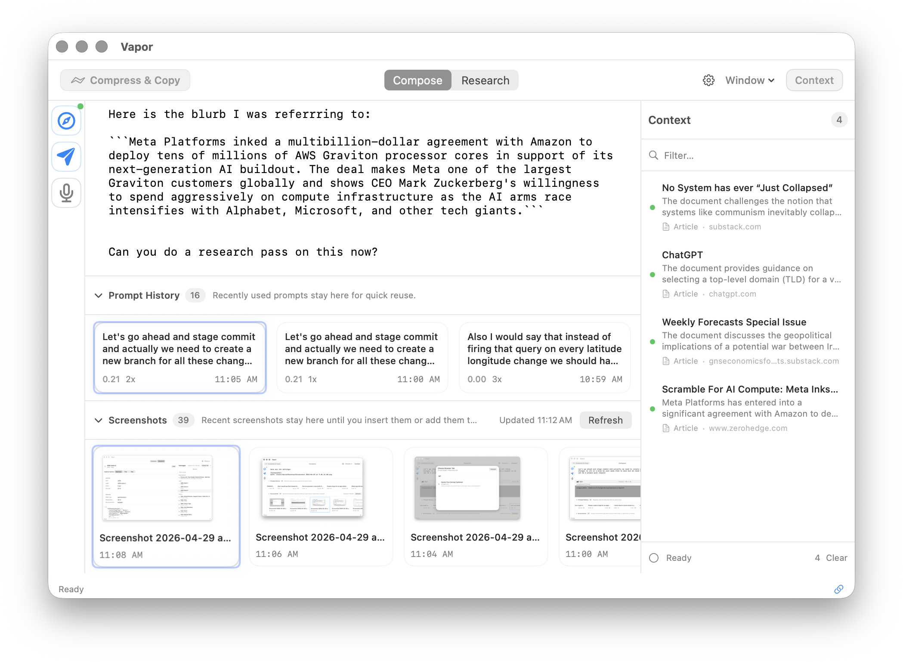
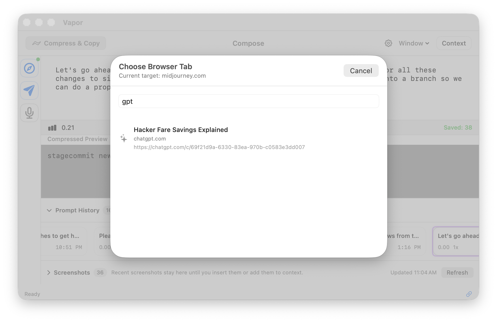
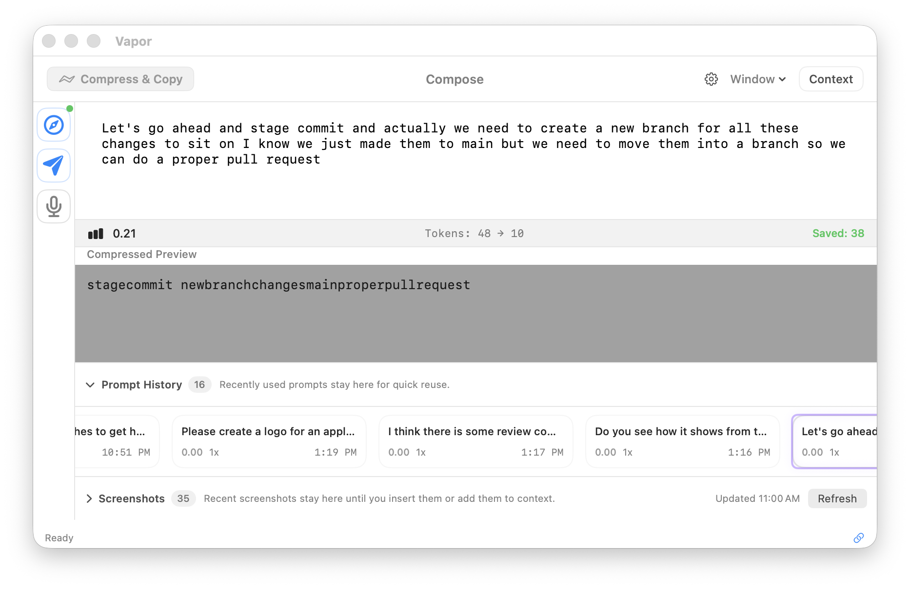

<p align="center">
  <br>
  <br>
  <strong>Vapor</strong><br>
  <em>The Prompting & Context OS for AI power users.</em>
  <br>
</p>

Vapor is a macOS floating app that turns your voice, screenshots, and browser research into context-rich prompts, and sends them directly into any AI chat. Capture context, compose, and inject without leaving your workflow.

## Install

```bash
brew install --cask memetic-research-labs/vapor/vapor
```

The full token is required: Homebrew already ships an unrelated `vapor` formula
and a `vapor-app` cask, so plain `brew install --cask vapor` installs different
software. You can also download the notarized DMG from
[Releases](https://github.com/memetic-research-labs/vapor/releases).

## Screenshots

<p align="center">
  <em>The floating prompt window - hold Fn to dictate, Vapor listens and transcribes on-device</em><br>
  
</p>

<p align="center">
  <em>Screenshot shelf - auto-detects screenshots, add to context with one keypress</em><br>
  
</p>

<p align="center">
  <em>Context tray - captured pages, articles, and research in a searchable sidebar</em><br>
  
</p>

<p align="center">
  <em>Browser injection - send prompts directly into any AI chat tab</em><br>
  
</p>

<p align="center">
  <em>Prompt compression - 40–60% token reduction, meaning preserved</em><br>
  
</p>

## Keyboard-First Interface

Vapor is designed to be driven entirely from the keyboard. Every core action is a single keypress or key combo: summon the window, dictate, capture, compress, and send without ever touching the mouse.

- **⌃⌥Space** - summon Vapor from anywhere on your Mac
- **Fn (hold)** - start voice dictation, release to stop
- **⌘↩** - compress the current prompt and copy to clipboard
- **⌘⇧P** - send the prompt directly into your active AI chat tab
- **⌘⇧S** - jump to the Screenshot Shelf
- **⌘⌥C** - open the Context Tray

The goal: stay in your flow. Dictate a thought, capture a screenshot, grab context from a browser tab, compress it all together, and inject it into your AI, without switching windows.

## Features

### Voice Dictation

Hold Fn to speak. Vapor uses Apple's on-device speech recognition. No cloud, no latency, no API key, no privacy tradeoff. Your words appear in the editor as you speak. Release Fn when done.

### Screenshot Shelf

Vapor auto-detects new screenshots on your Desktop. Open the shelf with ⌘⇧S, browse thumbnails, and add any screenshot to your prompt's context with one keypress. Vapor sees what you see.

### Context Tray

Captured pages, articles, browser research in one searchable sidebar. Open with ⌘⌥C, search by keyword, and insert context directly into your prompts. Everything you capture is processed through a pipeline that extracts entities, generates summaries, and builds citations.

### Agent Memory API

Vapor can index local agent sessions and expose them through an authenticated localhost API so agents can search prior conversation history and tool context. See [`docs/agent-memory-api.md`](docs/agent-memory-api.md).

### Research Interrogation

Scan live browser tabs for structured data: tables, JSON, XHR feeds, articles. Vapor discovers data sources on the pages you have open and captures them into context automatically.

### Browser Injection

Send prompts directly into ChatGPT, Claude, Gemini, Grok, Perplexity, and any site via the DOM picker. The Chrome extension (included in the DMG) connects Vapor to your AI chat tabs. No copy-paste needed.

### Prompt Compression

Reduce tokens by 40–60% while preserving meaning. Vapor strips filler words and fuses related concepts into dense, efficient prompts.

**Example:**

| | |
|---|---|
| **Original** (36 words) | write a web component that renders a canvas that changes color from blue to golden as the time of day changes mimicking the light as it would be where you are located if there were no clouds out site in the sky |
| **Compressed** (15 words) | webcomponent renders canvas changes color time day mimics sky location clouds out site sky |

Choose between two backends:

| | Local LLM | OpenRouter |
|---|-----------|------------|
| **Cost** | Free | ~$0.01/1M tokens |
| **Privacy** | On-device | Cloud |
| **Latency** | <1s | ~1–2s |
| **Setup** | Download model (2.3–4.7 GB) | API key required |

## Browser Integration

Chrome extension connects Vapor directly to AI chat tabs:

1. Load the extension (included in DMG)
2. Copy the auth token from Vapor Settings → Browser
3. Paste into the extension's Settings → Connected

**Supported:** ChatGPT, Claude, Gemini, Grok, Perplexity, and any site via the DOM picker.

## Keyboard Shortcuts

| Action | Shortcut |
|--------|----------|
| Start dictation | Fn (hold) |
| Compress & Copy | ⌘↩ |
| Copy Original | ⌘⇧C |
| Post to Browser Tab | ⌘⇧P |
| Copy & Clear | ⌘K |
| Focus Vapor (global) | ⌃⌥Space |
| Focus Screenshots | ⌘⇧S |
| Focus Context Tray | ⌘⌥C |
| Prompt History | ⌘Y |
| Context Tray | ⌘⇧E |
| Toggle Compact/Full | ⌘\\ |
| Keyboard Shortcuts | ⌘/ |

## Requirements

- macOS 14.0+ (Sonoma)
- Apple Silicon or Intel
- ~2–5 GB for local LLM model (optional - OpenRouter works without it)
- Chrome (for browser integration)

## Building

```bash
git clone https://github.com/memetic-research-labs/vapor.git
cd vapor/Vapor
open Vapor.xcodeproj
# Build & Run from Xcode
```

See [CONTRIBUTING.md](CONTRIBUTING.md) for detailed build instructions.

## Releasing

`MARKETING_VERSION` is the user-facing version and `CURRENT_PROJECT_VERSION` is
the build number. Both live on the **Vapor app target**; the test targets carry
their own unrelated values, so never read versions from them.

Bump `MARKETING_VERSION` for a normal release. If you rebuild a version that was
already published, bump `CURRENT_PROJECT_VERSION` instead — Homebrew compares
`<marketing>,<build>`, so reusing both would leave existing users on the old app.

```bash
# 0. set the version on the app target
make bump-version VERSION=1.0.8            # new release, build resets to 1
make bump-version VERSION=1.0.7 BUILD=2    # rebuild of a published version

# 1. build, sign, notarize, and staple (requires Apple credentials)
APPLE_ID=... APPLE_APP_SPECIFIC_PASSWORD=... scripts/build-release.sh

# ...or store the credentials once and skip the environment variables:
#   xcrun notarytool store-credentials vapor-notary \
#     --apple-id <apple-id> --team-id YRQLJYMX5S --password <app-specific-password>
NOTARY_KEYCHAIN_PROFILE=vapor-notary scripts/build-release.sh

# 2. rehearse the publish; validates everything, changes nothing
scripts/publish-release.sh dist/Vapor-<version>-<build>.dmg v<version> --dry-run

# 3. publish the release and open the Homebrew cask bump
scripts/publish-release.sh dist/Vapor-<version>-<build>.dmg v<version>
```

The tag must match the DMG's marketing version. The cask bump is merged only
after the tap's install checks pass.

The DMG contains `Vapor.app`, the `Browser Extension` folder loaded into Chrome,
and a versioned `README.html` generated from `scripts/dmg-readme.html.template`.

## Code of Conduct

This project follows the [Contributor Covenant Code of Conduct](CODE_OF_CONDUCT.md). By participating, you agree to uphold it.

## Trademarks

The Vapor name, logo, and app icon are trademarks of Memetic Research Labs LLC and are **not** licensed under the MIT License. See [TRADEMARKS.md](TRADEMARKS.md) for details.

## Feedback & Contributing

Vapor is an early proof of concept - we're just getting started and every bit of feedback helps shape where it goes next. If something breaks, feels slow, or doesn't work the way you'd expect, please let us know.

- **Bug reports & feature requests** - [open an issue on GitHub](https://github.com/memetic-research-labs/vapor/issues)
- **Ideas & discussion** - we'd love to hear how you're using Vapor and what you'd want to see next
- **Pull requests** - see [CONTRIBUTING.md](CONTRIBUTING.md) for build instructions

## License

MIT - see [LICENSE](LICENSE)
