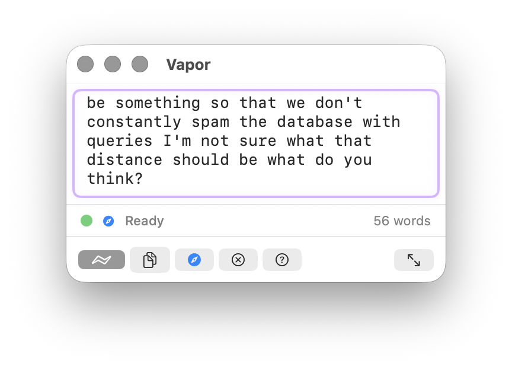

# Vapor

**The Prompting & Context OS for AI power users.**

Vapor is a macOS floating app that turns your voice, screenshots, and browser research into compressed, context-rich prompts — and sends them directly into any AI chat. Dictate, capture, compress, and inject without leaving your workflow.

## What It Does

| | |
|---|---|
| **Voice Dictation** | Hold Fn to speak — on-device transcription, no cloud |
| **Prompt Compression** | 40-60% token reduction via Local LLM or OpenRouter |
| **Browser Injection** | Send prompts straight into ChatGPT, Claude, Gemini tabs |
| **Research Interrogation** | Scan browser tabs for data — tables, JSON, XHR feeds, articles |
| **Context Tray** | Searchable sidebar of everything you've captured |
| **Screenshot Shelf** | Auto-detect screenshots, add to context with one keypress |

## Screenshots

<p align="center">
  <em>The floating prompt window — dictate, type, and manage context without switching apps</em><br>
  
</p>

<p align="center">
  <em>Screenshot shelf — auto-detects screenshots, add to context with one keypress</em><br>
  
</p>

<p align="center">
  <em>Context tray — captured pages, articles, and research in a searchable sidebar</em><br>
  
</p>

<p align="center">
  <em>Browser injection — send prompts directly into any AI chat tab</em><br>
  
</p>

<p align="center">
  <em>Prompt compression — 40–60% token reduction, meaning preserved</em><br>
  
</p>

## How It Works

```
Dictate or type → Compress (⌘↩) → Send to AI tab (⌘⇧P)
         ↑                                    ↓
    Screenshot Shelf ←── Context Queue ←─ Browser Capture
```

1. **Dictate** your prompt by holding the Fn key
2. **Compress** it — Vapor strips filler while preserving meaning
3. **Send** it directly into your AI chat — no copy-paste needed

Along the way, capture context from screenshots and browser tabs. Vapor extracts entities, builds citations, and keeps everything searchable.

## Compression Example

**Original** (36 words):
> write a web component that renders a canvas that changes color from blue to golden as the time of day changes mimicking the light as it would be where you are located if there were no clouds out site in the sky

**Compressed** (15 words):
> webcomponent renders canvas changes color time day mimics sky location clouds out site sky

## Compression Backends

| | Local LLM | OpenRouter |
|---|-----------|------------|
| **Cost** | Free | ~$0.01/1M tokens |
| **Privacy** | On-device | Cloud |
| **Latency** | <1s | ~1-2s |
| **Setup** | Download model (2.3–4.7 GB) | API key required |

## Browser Integration

Chrome extension connects Vapor directly to AI chat tabs:

1. Load the extension (included in DMG)
2. Copy the auth token from Vapor Settings → Browser
3. Paste into the extension's Settings → Connected

**Supported:** ChatGPT, Claude, Gemini, Grok, Perplexity, and any site via the DOM picker.

## Context System

Everything you capture flows through a processing pipeline:

- **Entity extraction** — people, orgs, products, locations, dates, URLs
- **Summarization** — auto-generated summaries of captured content
- **Tagging & citations** — automatic classification and source attribution
- **Vector embeddings** — semantic search across your context library (Phase 2)

Capture sources: browser pages, selected text, screenshots, pasted images, dropped files, article media.

## Keyboard Shortcuts

| Action | Shortcut |
|--------|----------|
| Start dictation | Fn (hold) |
| Compress & Copy | ⌘↩ |
| Copy Original | ⌘⇧C |
| Post to Browser Tab | ⌘⇧P |
| Copy & Clear | ⌘K |
| Focus Vapor (global) | ⌃⌥Space |
| Focus Screenshots | ⌘⇧S |
| Focus Context Tray | ⌘⌥C |
| Prompt History | ⌘Y |
| Context Tray | ⌘⇧E |
| Toggle Compact/Full | ⌘\\ |
| Keyboard Shortcuts | ⌘/ |

## Requirements

- macOS 14.0+ (Sonoma)
- Apple Silicon or Intel
- ~2–5 GB for local LLM model (optional — OpenRouter works without it)
- Chrome (for browser integration)

## Building

```bash
git clone https://github.com/memetic-research-labs/vapor.git
cd vapor/Vapor
open Vapor.xcodeproj
# Build & Run from Xcode
```

See [CONTRIBUTING.md](CONTRIBUTING.md) for detailed build instructions.

## Code of Conduct

This project follows the [Contributor Covenant Code of Conduct](CODE_OF_CONDUCT.md). By participating, you agree to uphold it.

## Trademarks

The Vapor name, logo, and app icon are trademarks of Memetic Research Labs LLC and are **not** licensed under the MIT License. See [TRADEMARKS.md](TRADEMARKS.md) for details.

## License

MIT — see [LICENSE](LICENSE)
