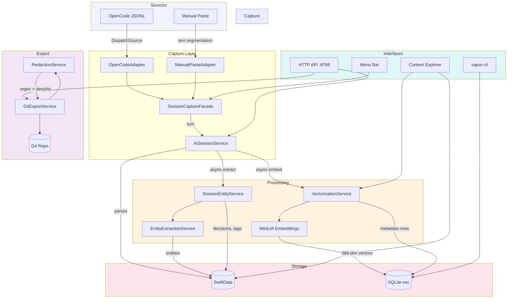
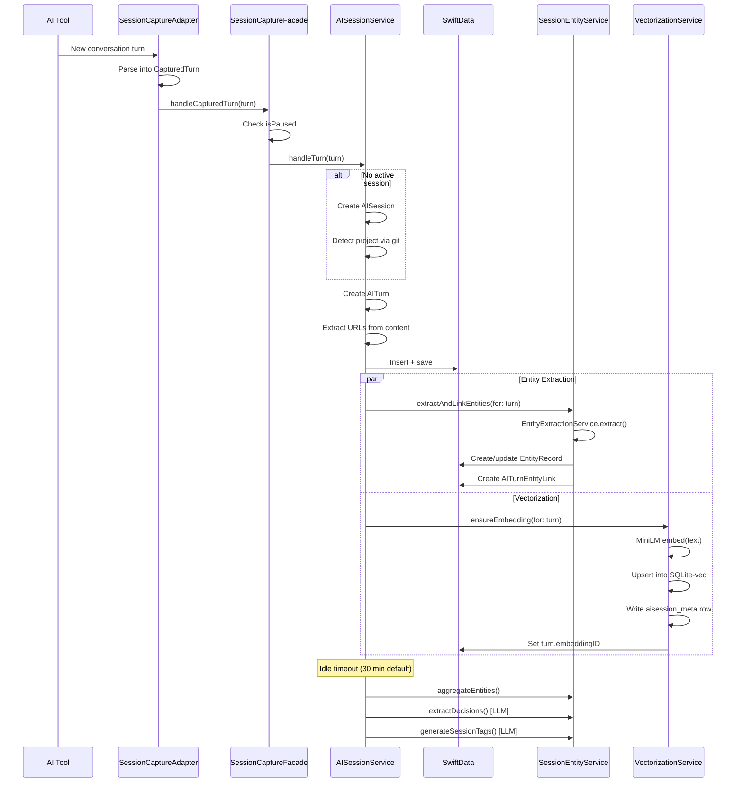
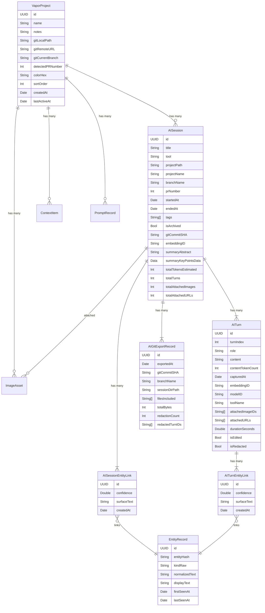
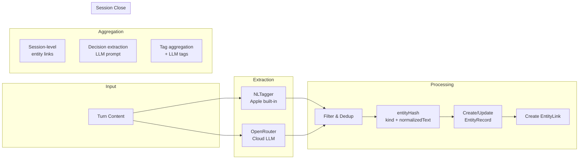
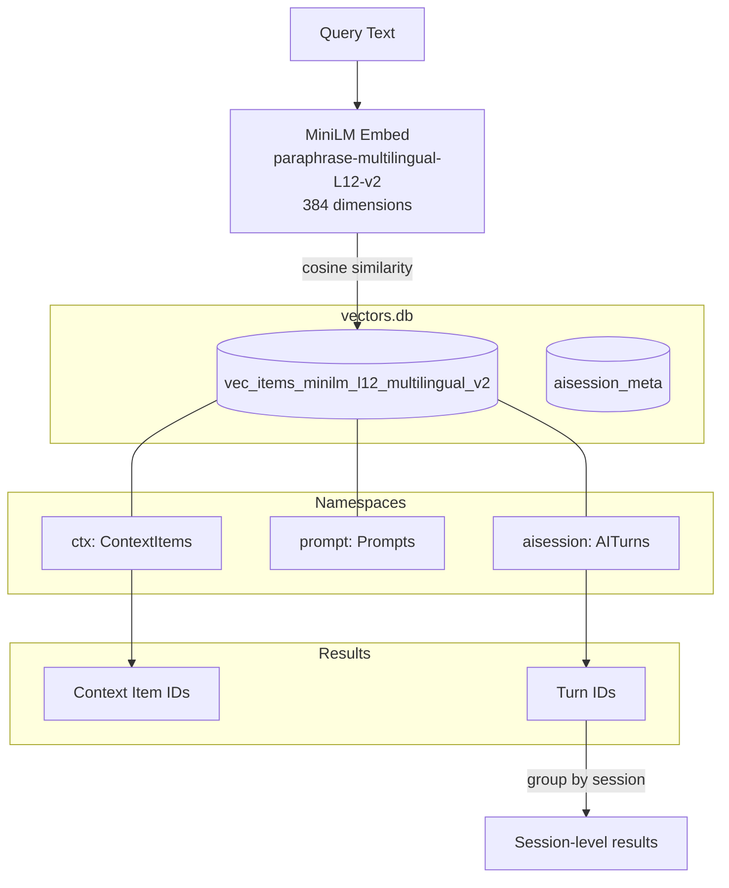
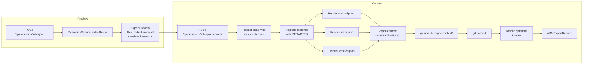

# AI Session Capture

Vapor automatically captures, indexes, and exports AI coding sessions. This document covers the architecture, data flow, HTTP API, CLI, and configuration.

---

## 1. Overview

Vapor watches your AI coding tools in real time, captures every conversational turn, extracts entities, generates embeddings for semantic search, and can export redacted transcripts back into your project's git history.



All capture is local-first. Data never leaves your machine unless you explicitly trigger a git export.

---

## 2. Session Capture Pipeline

Sessions are captured through a pluggable adapter pattern. Each adapter watches a source, parses conversational turns, and forwards them to a shared facade.



### Adapter Protocol

All adapters conform to `SessionCaptureAdapter`:

| Property/Method | Description |
|----------------|-------------|
| `toolName: String` | Unique identifier (e.g. "opencode", "manual-paste") |
| `isRunning: Bool` | Whether the adapter is actively watching |
| `isAvailable() async -> Bool` | Checks if the source is accessible |
| `startCapture() async throws` | Begin watching |
| `stopCapture() async` | Stop watching |
| `onTurnCaptured: ((CapturedTurn) -> Void)?` | Callback for each parsed turn |

### OpenCode Adapter

Tails `conversations.jsonl` via `DispatchSource` (file-level write events). Each line is parsed as JSON to extract `role`, `content`, `timestamp`, and `model`. Log paths are resolved in order:

1. `config.json` under the OpenCode config directory
2. `XDG_DATA_HOME/opencode/`
3. `~/Library/Application Support/opencode/`
4. `~/.opencode/`

### Manual Paste Adapter

Accepts raw pasted text and segments it into turns by detecting role prefixes: `>>`, `**Assistant:**`, `**User:**`, `>`, `You:`, `AI:`. Each segment becomes a `CapturedTurn`.

### Session Lifecycle

| State | Trigger | Action |
|-------|---------|--------|
| Open | First turn for a tool | Create `AISession`, detect project via `git rev-parse` |
| Active | Each turn | Create `AITurn`, reset idle timer, async extract + embed |
| Paused | Menu bar toggle | Drop incoming turns (orange dot indicator) |
| Closed | Idle timeout (30 min) or manual stop | Generate summary, aggregate entities, extract decisions, generate tags |

### Pause/Resume

The menu bar shows a green dot when capturing and an orange dot when paused. Pausing discards all incoming turns until resumed. The `isPaused` flag lives on `SessionCaptureFacade` and is checked synchronously in `handleCapturedTurn(_:)`.

---

## 3. Data Model



### EntityKind Expansion

The original 8 entity kinds were expanded to 16 to better represent AI session content:

| Kind | Description |
|------|-------------|
| `person` | People mentioned in turns |
| `organization` | Companies, teams, organizations |
| `product` | Products, services, tools |
| `location` | Physical locations |
| `date` | Temporal references |
| `url` | Web URLs (excluded from entity links, used for extraction only) |
| `number` | Numeric values |
| `code` | Code snippets, identifiers |
| `concept` | Abstract concepts |
| `model` | AI/ML model names |
| `tool` | Development tools, CLIs |
| `library` | Software libraries, packages |
| `api` | API endpoints, interfaces |
| `file` | File paths, references |
| `error` | Error messages, exceptions |
| `decision` | Architectural/design decisions (extracted via LLM) |

### Embedding Namespaces

Embedding IDs are namespaced to separate concerns within a single vector store:

| Prefix | Source | Description |
|--------|--------|-------------|
| `ctx:` | `ContextItem` | Captured web pages, documents, specs |
| `prompt:` | `PromptRecord` | Historical prompts |
| `aisession:` | `AITurn` | Individual AI session turns |

---

## 4. Entity Extraction & Tagging



### Two-Path Extraction

The `EntityExtractionService` supports two backends, configurable per entity type:

**NLTagger** (default, local, offline):
- Uses Apple's `NLTagger(tagSchemes: [.nameType])`
- Extracts persons, organizations, locations
- supplemented by regex extraction for URLs and dates
- No API calls required

**OpenRouter** (cloud, higher quality):
- Sends turn content (truncated to 8000 chars) to a configured LLM
- Default model: `google/gemma-3n-e4b-it`
- Returns structured entity list with kind, text, and confidence
- Falls back to NLTagger on API failure

### Entity Deduplication

Entities are deduplicated across all turns and sessions via an `entityHash` computed from `EntityKind.rawValue + normalizedText`. When an entity is seen again, the `EntityRecord.lastSeenAt` is updated and `displayText` is kept as the longest form observed. This means the same entity appearing across multiple sessions shares a single `EntityRecord`.

### Decision Extraction

On session close, the first 5 assistant turns (up to 300 chars each) are sent to OpenRouter (`google/gemini-2.0-flash-001`) with a prompt to extract architectural and design decisions. Each extracted decision becomes an `EntityRecord(kind: .decision, ...)` linked to the session.

### Tag Pipeline

Tags are generated from three sources:

1. **Auto-tags** (per turn): Role keywords and entity names extracted during turn processing
2. **Aggregated tags** (session close): Tags appearing in 2+ turns are promoted to session-level
3. **LLM tags** (session close): 3-5 high-level tags generated by sending turn summaries to OpenRouter

All three sources are merged and deduplicated into `AISession.tags`.

---

## 5. Semantic Search



### How It Works

1. The query text is embedded using the same MiniLM model that generated the stored vectors
2. SQLite-vec performs a k-nearest-neighbor search using cosine distance
3. Results are filtered by namespace prefix (`ctx:`, `prompt:`, `aisession:`)
4. The prefix is stripped to recover the original SwiftData `UUID`
5. Full records are fetched from SwiftData for display

### Searchable Text Composition

The quality of semantic search depends heavily on what text is embedded. Vapor composes a rich prefix for each turn embedding:

```
ROLE: assistant
MODEL: claude-3.5-sonnet
TOOL: opencode
SESSION: Fix compilation errors in RedactionService

[full turn content here]
```

This means a query like "claude fixing swift errors" will match turns from Claude sessions about Swift compilation, even if those exact words don't appear in the turn.

### CLI-Side Search

The `aisession_meta` relational table in `vectors.db` enables metadata-based SQL filtering without requiring the embedding model:

```sql
SELECT turn_id, session_id, role, tool, model_id, captured_at
FROM aisession_meta
WHERE tool = 'opencode' AND role = 'user'
ORDER BY captured_at DESC
LIMIT 20
```

The `vapor search` CLI command uses this path. The `vapor sessions` command also reads from this table.

### Backfill

On app launch, `VectorizationService` checks for records with `embeddingID == nil` and processes them in batches of 20 with a concurrency limit of 4. Separate backfill methods exist for sessions, context items, and prompts.

---

## 6. Git Export & Redaction



### Export Directory Structure

```
<project-root>/
  .vapor-context/
    .gitattributes              # binary rules, symlink rules
    sessions/
      2025-01-15/
        <session-uuid>/
          transcript.md          # Redacted markdown transcript
          meta.json              # Session metadata + redaction stats
          entities.json           # Entity links with occurrences
          vectors.jsonl           # Turn embedding IDs (one per line)
          urls/
            references.jsonl      # Deduplicated URL references
          images/
            <image-uuid>.webp     # Linked screenshots
          media/
            <media-uuid>.pdf      # PDFs, videos, GIFs
    by-branch/
      main/
        <session-uuid> -> ../../sessions/2025-01-15/<session-uuid>
    branches/
      main/
        sessions.jsonl           # Branch index entries
  .gitattributes                 # linguist-generated rule
```

### Redaction Patterns

Regex-based detection runs automatically on every export. Matches are replaced with `[REDACTED: reason]`.

| Category | Patterns | Reason |
|----------|----------|--------|
| API keys | `sk-or-v1-*`, `sk-ant-*`, `ghp_*`, `gho_*`, `glpat-*` | `api-key-pattern` |
| Bearer tokens | `Bearer [base64]+` | `bearer-token-pattern` |
| Generic secrets | `password/secret/token/api_key = value` | `generic-secret-pattern` |
| Sensitive paths | `~/.ssh/*`, `.env`, `.id_rsa`, `~/.aws/credentials` | `sensitive-path` |
| Internal URLs | `internal.*.(com\|net\|io)`, `localhost:port` | `internal-url` |
| User denylist | Configurable regex patterns in Settings | `user-denylist` |

### User Denylist

Additional regex patterns can be configured in Settings (Export & Redaction tab) or via the API:

```
PUT /api/export/config
{ "denylistPatterns": ["my-secret-regex", "another-pattern"] }
```

Patterns are stored in `UserDefaults` under `exportDenylistPatterns` and applied alongside built-in patterns during export.

### Sensitive Content Warning

Before export, `RedactionService.detectSensitiveContentInSession()` scans all turn content for keywords like "password", "secret", "token", "credential", "api.key", "private.key". If any are found, the export preview sheet displays a red warning banner listing the detected keywords.

### Branch Alignment

When a session has a `branchName`:

1. A symlink is created at `.vapor-context/by-branch/<branch>/<uuid>` pointing to the session directory
2. A JSONL entry is appended to `.vapor-context/branches/<branch>/sessions.jsonl` with session metadata

This lets you browse exported sessions by git branch without needing to know the date.

---

## 7. HTTP API Reference

All routes are served on port `8766` (same server as the existing Vapor HTTP API).

### Sessions

| Method | Path | Description | Query/Body Params |
|--------|------|-------------|-------------------|
| `GET` | `/api/sessions` | List sessions | `tool`, `project`, `branch`, `limit`, `offset` |
| `GET` | `/api/sessions/:id` | Full session detail (turns, entities, summary) | |
| `GET` | `/api/sessions/:id/turns` | Paginated turns | `role`, `limit`, `offset` |
| `GET` | `/api/sessions/:id/summary` | Session summary + stats | |
| `GET` | `/api/sessions/:id/entities` | Session entity links | |
| `GET` | `/api/sessions/:id/tags` | Session tags | |
| `DELETE` | `/api/sessions/:id` | Archive session (soft delete) | |

### Export

| Method | Path | Description | Body |
|--------|------|-------------|------|
| `POST` | `/api/sessions/:id/export` | Preview export (redaction info, file list) | |
| `POST` | `/api/sessions/:id/export/commit` | Trigger git export | `{ "projectRoot": "/path/to/repo" }` |
| `GET` | `/api/export/config` | Get export configuration | |
| `PUT` | `/api/export/config` | Update export configuration | `{ "denylistPatterns", "autoCommit", "includeMedia", "includeVectors", "screenshotLinkWindow" }` |

### Search

| Method | Path | Description | Body |
|--------|------|-------------|------|
| `POST` | `/api/search/sessions` | Semantic search for sessions | `{ "query", "limit", "projectId", "tool" }` |
| `POST` | `/api/search/turns` | Search turns (keyword + metadata filter) | `{ "query", "limit", "projectId", "role" }` |

### Projects

| Method | Path | Description | Body/Params |
|--------|------|-------------|------------|
| `GET` | `/api/projects` | List all projects | |
| `POST` | `/api/projects` | Create project | `{ "name" }` |
| `GET` | `/api/projects/:id` | Get project detail | |
| `PUT` | `/api/projects/:id` | Update project | `{ "name", "notes", "colorHex" }` |
| `GET` | `/api/projects/:id/context` | Context items for project | |
| `GET` | `/api/projects/:id/sessions` | Sessions for project | |
| `GET` | `/api/projects/:id/entities` | Unique entities across project sessions | |

---

## 8. CLI Reference

The `vapor` binary is a separate SwiftPM package at `vapor-cli/`. It reads directly from `~/Library/Application Support/lol.mrl.app.Vapor/vectors.db` via `sqlite3`.

### `vapor search` -- Semantic and metadata search

```bash
vapor search "swift concurrency errors" --tool opencode --limit 10 --format json
```

| Option | Description | Default |
|--------|-------------|---------|
| `query` (positional) | Search query | required |
| `--project <id>` | Filter by project UUID | |
| `--tool <name>` | Filter by tool name | |
| `--limit <n>` | Max results | 20 |
| `-f, --format` | `table` or `json` | table |

### `vapor sessions` -- List and view sessions

```bash
vapor sessions --tool opencode --limit 10
vapor sessions --show <session-id> --format json
```

| Option | Description | Default |
|--------|-------------|---------|
| `--show <id>` | Show specific session | |
| `--tool <name>` | Filter by tool | |
| `--limit <n>` | Max results | 20 |
| `-f, --format` | `table` or `json` | table |

### `vapor entities` -- Search and graph entities

```bash
vapor entities --kind library --limit 30
```

| Option | Description | Default |
|--------|-------------|---------|
| `-k, --kind <kind>` | Filter by entity kind | |
| `--limit <n>` | Max results | 30 |
| `-f, --format` | `table` or `json` | table |

### `vapor projects` -- List and manage projects

```bash
vapor projects --limit 20 --format json
```

| Option | Description | Default |
|--------|-------------|---------|
| `--limit <n>` | Max results | 20 |
| `-f, --format` | `table` or `json` | table |

### `vapor import` -- Re-import exported sessions

```bash
vapor import --path /path/to/project --format json
```

| Option | Description | Default |
|--------|-------------|---------|
| `-p, --path <dir>` | Project root containing `.vapor-context/` | cwd |
| `-f, --format` | `table` or `json` | table |
| `--reembed` | Flag to indicate re-embedding is needed | false |

### `vapor status` -- Database stats

```bash
vapor status
```

Reports: store path, store size, vectors directory size, vector count, session metadata rows, projects with data.

---

## 9. Settings & Configuration

All settings are stored in `UserDefaults`.

### Session Capture

| Key | Type | Default | Description |
|-----|------|---------|-------------|
| `sessionCaptureEnabled` | `Bool` | `false` | Master toggle for capture |
| `sessionCaptureOnboarded` | `Bool` | `false` | Whether onboarding was shown |
| `openCodeLogPath` | `String?` | auto-detect | Custom OpenCode log path |
| `sessionIdleTimeoutMinutes` | `Double` | `30` | Minutes before auto-close |
| `screenshotLinkWindow` | `Double` | `30` | Seconds window for linking screenshots |

### Export & Redaction

| Key | Type | Default | Description |
|-----|------|---------|-------------|
| `exportAutoCommit` | `Bool` | `false` | Auto-commit on export |
| `exportIncludeMedia` | `Bool` | `true` | Include images and media in export |
| `exportIncludeVectors` | `Bool` | `true` | Include vectors.jsonl in export |
| `exportDenylistPatterns` | `[String]?` | `[]` | User-defined regex denylist |

### Context Explorer

| Key | Type | Default | Description |
|-----|------|---------|-------------|
| `contextExplorerState.v2` | `Data` | (encoded JSON) | Persisted filter state, selected section, search text |

---

## 10. UI Guide

### Context Explorer -- AI Sessions Section

The Context Explorer sidebar has an "AI" section with an "AI Sessions" entry (bubble icon). Clicking it shows `SessionListView` -- a scrollable list of non-archived sessions sorted by start date, each showing:

- Title, tool badge, turn count, branch name, date
- Tags (up to 4 shown, with overflow count)
- Project filtering from the Projects section above

Clicking a session opens `SessionReaderView` inline.

### Session Reader View

Displays a session's turns chronologically:

- **Header**: title, tool, branch, PR, date, duration, tags
- **Summary**: auto-generated abstract (if available)
- **Turn cards**: role badge (color-coded), model ID, timestamp, monospaced content, attached URLs, linked screenshots
- **Turn actions** (ellipsis menu): copy text, mark/unmark as private

### Export Flow (UI)

The export button in `SessionReaderView` opens `ExportPreviewSheet`:

1. **Preview phase**: Shows file list, redaction count, sensitive keyword warnings, detected project path
2. **Configuration**: Override or confirm project root directory
3. **Commit**: Triggers async export with progress indicator
4. **Completion**: Green checkmark confirmation

### Menu Bar

When session capture is active, the menu bar shows:

- **Green dot** + "Capturing" label when actively capturing
- **Orange dot** + "Capture Paused" label when paused
- **Pause/Resume** toggle
- **Stop Capture** button
- Standard Show Vapor, Settings, Quit entries

### Settings

Three new tabs in Settings:

| Tab | Contents |
|-----|----------|
| **Session Capture** | Enable toggle (with onboarding on first enable), OpenCode log path, idle timeout slider (5-120 min), screenshot link window slider (5-120s) |
| **Projects** | Create project form, project list with color dots, item counts, edit/delete actions |
| **Export & Redaction** | Auto-commit toggle, media inclusion toggle, denylist regex editor (one pattern per line) |
